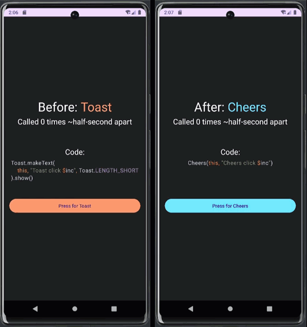

# Cheers

### An Android Toast wrapper to queue and show multiple messages one at a time in sequential order.
<br>



### A toast tends to have only one person speak. Cheers includes everyone.
- Standard Toast tends to overwrite the prior message if more than one is called too quickly. Cheers instead queues each message then automatically displays each in order as they become available.
- Short, familiar, and simple syntax. Only a single call to learn and Cheers automatically queues and shows messages.
- No setup code required before using Cheers. Just call `Cheers()` and it handles the rest!
- Optional configuration to display Cheers only while debugging. Or instead, define individual messages intended only for debug builds (dedicate Cheers as a debugging tool entirely if you wish!).
<br><br>

## Table of Contents
- [Examples](#examples)
- [Syntax](#syntax)
- [Installation](#installation)
- [Versioning](#versioning)
- [License](#license)
<br><br>

## Examples

### Example 1: Simplest

This Cheer defaults to a short Cheer [duration](#duration) and will show for any build of your app (except for [global configuration](#global-settings) changes).
```kotlin
Cheers(this, "Cheers Message!")

// or written as:
Cheers(
    activity = this,
    message = "Cheers message example 1!"
)
```
<br>

### Example 2: Exhausted

This Cheer creates a long [duration](#duration) Cheer that will only display on debug builds of your app (regardless of [global configuration](#global-settings) changes).
```kotlin
Cheers(
    activity = this@MainActivity,
    message = "Cheers message example 2!",
    duration = Cheers.LENGTH_LONG,
    onlyShowIfDebugging = true
)
```
<b>NOTE:</b> If `onlyShowIfDebugging` was set to `false` in this example, this Cheer would display on both debug and release builds of your app regardless if the [global configuration](#global-settings) changes. `onlyShowIfDebugging` is `null` by default which when unchanged uses the global configuration, [Cheers.GlobalConfig.onlyShowIfDebuggingAndNullConstructorParam](#global-settings).
<br><br>

## Syntax

### Main Syntax

Usage is simply calling [Cheers()](#examples) passing up to four arguments (2 required and 2 optional) into its constructor:

- <b>`activity`</b> - Activity / <i><b>Required</b></i>
  - Active Activity. Needed for displaying Toast and finding if app is running in debug.
- <b>`message`</b> - Any / <i><b>Required</b></i>
  - Message to display in Toast when available. Value calls `toString()` before being passed as Toast text.
- <b>`duration`</b> - CheerDuration / <i><b>Optional</b></i> (Defaults to [Cheers.LENGTH_SHORT](#duration) if undefined)
  - How long the Toast displays for. Can be [Cheers.LENGTH_SHORT](#duration), [Cheers.LENGTH_LONG](#duration), or undefined.
- <b>`onlyShowIfDebugging`</b> - Boolean / <i><b>Optional</b></i> (Defaults to `null` if undefined)
  - If `false`: Toast will always queue or show (regardless if debug or release build).
  - If `true`: Toast will only queue or show if app is debugging. 
  - If `null` or undefined: Will observe [GlobalConfig.onlyShowIfDebuggingAndNullConstructorParam](#global-settings) flag:
    - If `false` (default value if unchanged): Toast will always queue or show (regardless if debug or release build).
    - If `true`: Toast will only queue or show if app is debugging. 


See [Examples](#examples) section for code using these arguments.

### Global Settings
`Cheers.GlobalConfig` has all the public configurable settings that can be updated anytime during runtime. If any are intended to be updated, it is recommended to do so as soon as possible (like in your main activity's `OnCreate()`). 

The following are the settings set to their default values.
- ```kotlin
  /**
   * If Cheers constructor argument [duration] is undefined, the following will be the default Toast duration.
   * This will affect every Cheer that does not pass [duration] into the constructor.
   * Possible values: [Cheers.LENGTH_SHORT] and [Cheers.LENGTH_LONG].
   */
  Cheers.GlobalConfig.defaultCheerDuration = Cheers.LENGTH_SHORT
  
  /**
   * Global setting for if every Cheer should show only when debugging.
   * Cheers constructor argument [onlyShowIfDebugging] MUST be null (or undefined) for variable to have any effect.
   * If [onlyShowIfDebugging] is null, when [onlyShowIfDebuggingAndNullConstructorParam] is true, calling Cheers will only show Toast if app is debugging.
   * When false, calling Cheers will always show Toast, regardless if debugging or release.
   */
  Cheers.GlobalConfig.onlyShowIfDebuggingAndNullConstructorParam = false  
  ```

### Duration
Similar to Toast, only two lengths can be defined, short or long. Either can be passed in to the [constructor](#examples) or globally to [Cheers.GlobalConfig.defaultCheerDuration](#global-settings)
- ```kotlin
  Cheers.LENGTH_SHORT
  Cheers.LENGTH_LONG
  ```

### Clear the queue
To clear all pending messages from queue, call `Cheers.clearQueue()` any time.
<br><br>

## Installation

### Install with AAR and gradle (Local)
1) Download the latest [cheers.aar](cheers.aar).
2) Move `cheers.aar` to your project's `libs` directory (Example: `YourProject/app/libs/`).
3) In your `build.gradle`, add <b>only one</b> of the following to your `dependencies { }`:
- ```groovy
  // adds only cheers.aar
  implementation fileTree(dir: "libs", include: ["cheers.aar"])
  
  // OR

  // adds all .aar files in your libs directory.
  implementation fileTree(dir: "libs", include: ["*.aar"]) 
  ```
4) [Sync gradle](https://www.delasign.com/blog/how-to-sync-an-android-project-with-its-gradle-files-in-android-studio/) successfully.
5) Done! Your Android project is now ready to use Cheers. Go to [Examples](#examples) or [Syntax](#syntax) for Cheers usage!

### Install with gradle (Remote)
>Coming soon!

<br>

## Versioning
- [SemVer](http://semver.org/) is used for versioning.
- Given a version number MAJOR . MINOR . PATCH
    1) MAJOR version - Incompatible API changes.
    2) MINOR version - Functionality added in a backwards-compatible manner.
    3) PATCH version - Backwards-compatible bug fixes.
<br><br>

## License
Cheers created by Adam Steinberg of DIGIDEMIC, LLC
```
Copyright 2023 DIGIDEMIC, LLC

Licensed under the Apache License, Version 2.0 (the "License");
you may not use this file except in compliance with the License.
You may obtain a copy of the License at

    http://www.apache.org/licenses/LICENSE-2.0

Unless required by applicable law or agreed to in writing, software
distributed under the License is distributed on an "AS IS" BASIS,
WITHOUT WARRANTIES OR CONDITIONS OF ANY KIND, either express or implied.
See the License for the specific language governing permissions and
limitations under the License.
```